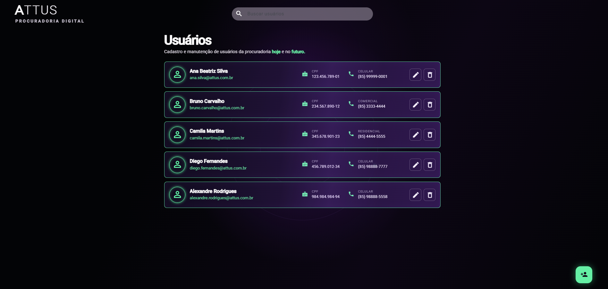

# 🚀 ATTUS - Procuradoria Digital (Desafio Frontend)



Este projeto consiste na implementação do módulo de gerenciamento e manutenção de usuários da **ATTUS - Procuradoria Digital**. A aplicação foi construída utilizando **Angular 17+**, focando em alta performance, reatividade moderna com Signals e uma experiência de usuário (UX) premium com um tema escuro futurista.

---

## 🎨 Identidade Visual & UX
Diferente do protótipo padrão, o design desta aplicação foi inspirado na identidade de vanguarda da própria plataforma web da ATTUS.
* **Interface Dark Mode:** Cores profundas que reduzem a fadiga visual dos procuradores.
* **Detalhes em Neon (Roxo e Verde):** Destaques reativos que guiam o olhar do usuário pelas ações da tela.
* **Componentização com Angular Material:** Cards elegantes e feedback visual instantâneo para todas as operações do CRUD.

---

## 🛠️ Decisões Técnicas & Diferenciais

* **Angular Signals:** Utilizado para o gerenciamento de estado local (`loading`, `error`, `users`), garantindo renderizações cirúrgicas e eficientes no ecossistema da aplicação.
* **Estratégia ChangeDetectionStrategy.OnPush:** Configurada para evitar verificações desnecessárias na árvore de componentes, otimizando drasticamente o desempenho.
* **Busca Otimizada com RxJS (Debounce Time):** Implementado um atraso reativo de `300ms` no input de pesquisa combinado com o operador `distinctUntilChanged`. Isso evita requisições redundantes ou concorrentes à API (atendendo estritamente ao Requisito 4.1 do projeto).
* **Prevenção contra Memory Leaks:** Uso do `takeUntilDestroyed(this.destroyRef)` no fluxo principal de unificação de dados (`merge`), garantindo a desalocação de memória nativa assim que o componente sai do DOM.
* **Performance no DOM:** Implementação do método `trackByUserId` no laço `@for` para impedir o redesenho total do Grid de Cards durante atualizações pontuais.

---

## 💻 Como Rodar o Projeto Localmente

### 1. Pré-requisitos
Certifique-se de ter instalado em sua máquina:
* **Node.js** (versão 18 ou superior)
* **Angular CLI** (versão 17+)

### 2. Instalar Dependências
No diretório raiz do projeto, instale os pacotes do projeto executando:
```bash
npm install